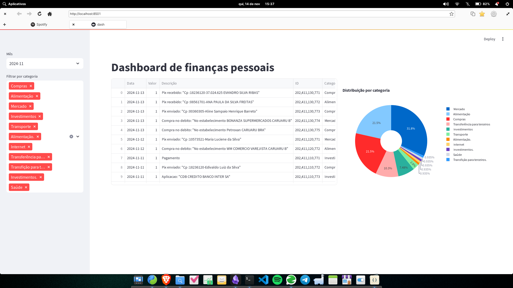

# Personal Finance Dashboard

A Python application that processes bank statements (OFX files) and categorizes transactions using LLaMA 2 local instance via Ollama.



## Features
- OFX file parsing
- AI-powered transaction categorization
- Interactive dashboard with Streamlit
- Expense distribution visualization

## Setup

1. Install requirements:
```bash
pip install -r requirements.txt
```

2. Install Ollama:
```bash
# macOS/Linux
curl -fsSL https://ollama.com/install.sh | sh

# Windows
# Download from https://ollama.com/download
```

3. Pull and run LLaMA 2 model:
```bash
ollama pull llama2
ollama run llama2
```

## Usage

1. Place your OFX files in the `extratos` folder

2. Process transactions:
```bash
python script.py
```

3. Launch dashboard:
```bash
streamlit run dash.py
```

## Project Structure
- `script.py`: OFX parser and transaction categorizer
- `dash.py`: Streamlit dashboard
- `extratos/`: Directory for OFX files
- `transacoes_categorizadas.csv`: Generated categorized transactions

## Categories
- Alimentação (Food)
- Receitas (Income)
- Saúde (Health)
- Mercado (Market)
- Educação (Education)
- Compras (Shopping)
- Construção (Construction)
- Investimentos (Investments)
- Transferência (Transfers)
- Internet
- Moradia (Housing)
- Transporte (Transport)

## Requirements
- Python 3.8+
- Ollama with LLaMA 2
- 8GB+ RAM recommended
